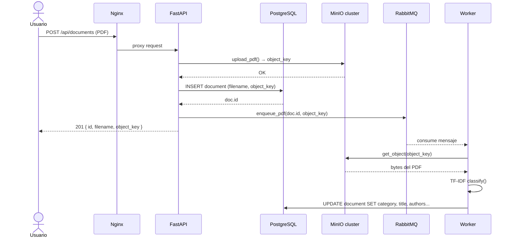
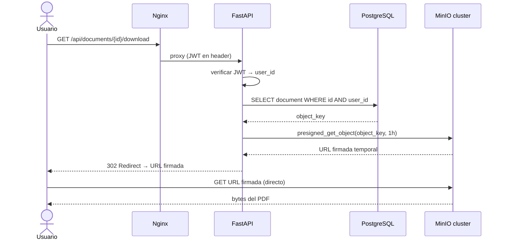
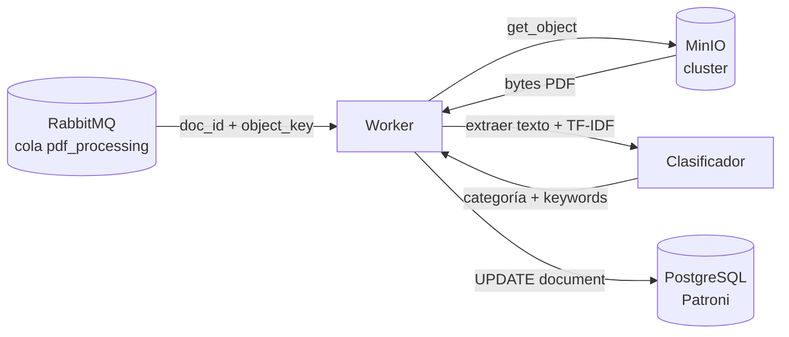
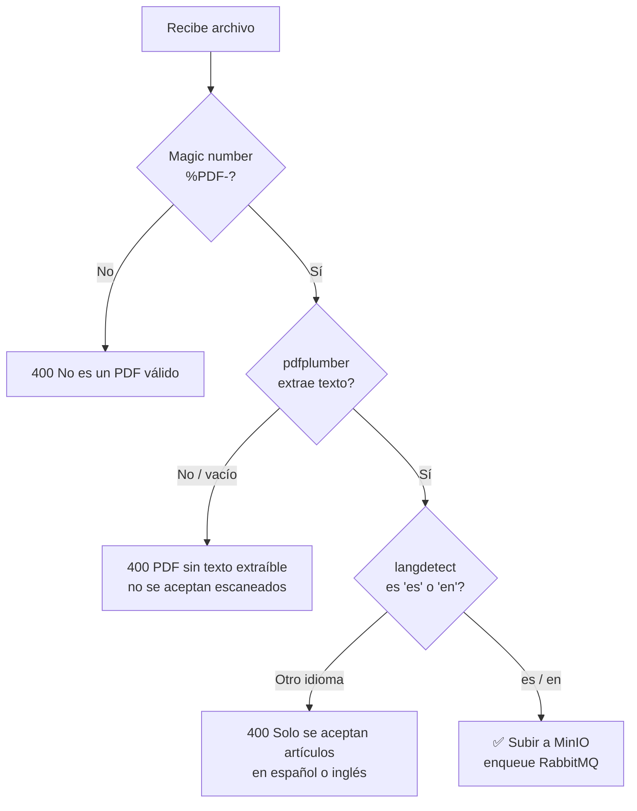

# ScienClassifier (Backend)

Backend del sistema distribuido de almacenamiento y análisis de artículos científicos.
Arquitectura simétrica de 3 nodos orquestada con **Docker Swarm**.

## Estado actual

| Componente | Estado |
|------------|--------|
| `stack.yml` Docker Swarm | ✅ completo |
| MinIO cluster (3×2 drives) | ✅ implementado y probado |
| FastAPI — auth (registro/login JWT) | ✅ |
| FastAPI — subida/descarga/eliminación de PDFs | ✅ |
| FastAPI — generación de citas APA7 | ✅ |
| FastAPI — endpoints de admin | ✅ |
| RabbitMQ — productor (enqueue) | ✅ |
| PostgreSQL — modelos User + Document | ✅ |
| Validación PDF (magic number + texto extraíble + idioma) | ✅ probado con artículos reales |
| Worker — clasificador TF-IDF (8 categorías, umbral 20%) | ✅ probado con artículos reales |
| Worker — consumidor RabbitMQ | ✅ |
| PostgreSQL — tabla `document_categories` (score por categoría) | ✅ |
| `GET /api/documents` con categorías incluidas | 🔄 pendiente |
| Frontend Angular | 🔄 pendiente |
| Dockerfile FastAPI + Worker | 🔄 pendiente |

---

## Flujo de datos

### Subida de PDF



### Descarga de PDF



### Clasificación asíncrona (Worker)



---

## Estructura del proyecto

```
ScienClassifier_Backend/
├── stack.yml                     # Stack Docker Swarm — todos los servicios
├── main.py                       # Entrypoint FastAPI (lifespan: crea tablas + bucket)
├── requirements.txt              # Dependencias Python
├── app/
│   ├── api/
│   │   └── endpoints.py          # 12 endpoints REST
│   ├── core/
│   │   └── jwt_connections.py    # bcrypt + JWT sign/decode + dependencias FastAPI
│   ├── db/
│   │   └── sql_connections.py    # Modelos SQLAlchemy: User, Document
│   └── services/
│       ├── minio_connection.py   # upload, download (presigned), delete, delete batch
│       └── rabbitmq_connection.py # enqueue_pdf → cola pdf_processing
├── worker/
│   ├── keywords.py               # 8 categorías × ~45 keywords es/en
│   ├── classifier.py             # TF-IDF + cosine similarity + extracción de metadatos
│   └── rbmq_consumer.py          # Consume cola pdf_processing → clasifica → guarda en DB
├── nginx/
│   └── nginx.conf                # Sirve Angular en / + proxea /api/ a FastAPI
├── rabbitmq/
│   └── rabbitmq.conf             # Peer discovery clásico para cluster de 3 nodos
└── tests/
    └── docker-compose.minio-test.yml  # Prueba local del cluster MinIO
```

---

## Clasificador de artículos

### Categorías disponibles (8)

| Categoría | Ejemplos de keywords |
|-----------|---------------------|
| matemáticas | ecuación, integral, álgebra, teorema, matrix, calculus |
| física | electrón, mecánica cuántica, relatividad, astrofísica, quantum |
| química | molécula, catalizador, síntesis, espectroscopia, polymer |
| biología | célula, ADN, evolución, CRISPR, proteína, genome |
| computación | algoritmo, machine learning, neural network, dataset, API |
| ingeniería | diseño, automatización, robótica, sensor, CAD, PLC |
| medicina | diagnóstico, ensayo clínico, paciente, stress, biomarker |
| ciencias sociales | sociedad, encuesta, psicología, identidad, team, survey |

### Funcionamiento

1. El texto del PDF se limpia (minúsculas, sin caracteres especiales, sin artefactos CID)
2. TF-IDF calcula la similitud coseno entre el artículo y las keywords de cada categoría
3. Los scores se normalizan a 0–100%
4. Solo se devuelven las categorías con **score ≥ 20%** (umbral configurable en `keywords.py`)

Un artículo puede pertenecer a varias categorías — por ejemplo un paper sobre la capa de ozono puede mostrar química 42% + física 31% + matemáticas 18%.

### Metadatos extraídos automáticamente

| Campo | Método |
|-------|--------|
| Título | Primera línea significativa (>20 chars, sin año) |
| Autores | Regex sobre patrones `Authors:` / `Autores:` + fallback por nombres propios |
| Año | Primer año entre 1900–2099 en las primeras 500 chars |

> Los metadatos son aproximados y mejoran con artículos bien formateados. Se usan para generar citas APA7.

### Resultados con artículos reales de prueba

| Artículo | Categorías detectadas |
|----------|-----------------------|
| Stress and Coping (Mars mission) | ciencias sociales 100%, medicina 31% |
| Reconocimiento capas internas Tierra | física 100%, computación 81% |
| Computación cuántica | computación 100%, física 88% |
| Tesis SILI (La Plata) | computación 100%, física 89% |
| Artículo COVID-19 | computación 100%, física 88%, medicina 67% |

---

## Validación de PDFs

El endpoint `POST /api/documents` aplica tres checks en orden antes de subir a MinIO:



| Check | Librería | Rechaza si |
|-------|----------|------------|
| Es un PDF real | bytes nativos | No empieza con `%PDF-` |
| Tiene texto extraíble | `pdfplumber` | PDF de imágenes / escaneado |
| Idioma válido | `langdetect` | Idioma distinto a `es` o `en` |

> **Frontend**: puede pre-validar extensión, `content-type` y tamaño para dar feedback inmediato, pero no reemplaza la validación del backend.

> **Limitación de idioma**: el sistema solo acepta artículos científicos en **español** e **inglés**.

---

## API — Endpoints

### Auth
| Método | Ruta | Descripción |
|--------|------|-------------|
| `POST` | `/api/auth/register` | Registro de usuario |
| `POST` | `/api/auth/login` | Login → JWT |

### Documentos (requiere JWT)
| Método | Ruta | Descripción |
|--------|------|-------------|
| `POST` | `/api/documents` | Subir PDF |
| `GET` | `/api/documents` | Listar documentos propios |
| `GET` | `/api/documents/{id}/download` | Descargar PDF (redirect a presigned URL) |
| `DELETE` | `/api/documents/{id}` | Eliminar un documento |
| `POST` | `/api/documents/delete-batch` | Eliminar múltiples documentos |
| `POST` | `/api/documents/apa7` | Generar citas APA7 |

### Admin (requiere JWT con rol admin)
| Método | Ruta | Descripción |
|--------|------|-------------|
| `GET` | `/api/admin/users` | Listar todos los usuarios |
| `DELETE` | `/api/admin/users/{id}` | Eliminar usuario (y sus documentos) |
| `PATCH` | `/api/admin/users/{id}` | Modificar username/contraseña |
| `DELETE` | `/api/admin/documents/{id}` | Eliminar documento de cualquier usuario |

---

## Tecnologías

- **Python 3.x** + **FastAPI** — API REST
- **SQLAlchemy** + **PostgreSQL** — persistencia (via Patroni + etcd)
- **MinIO** — almacenamiento de objetos distribuido (erasure coding 3+3)
- **RabbitMQ** — cola de mensajes para procesamiento asíncrono
- **Docker Swarm** — orquestación multi-nodo
- **Nginx** — punto de entrada unificado (Angular + proxy API)
- **JWT** + **bcrypt** — autenticación stateless
- **Tailscale** — red overlay para demo

---

## Despliegue

### 1. Inicializar el Swarm (desde máquina 1)

```bash
docker swarm init --advertise-addr <IP_MAQUINA1>
# Guardar el token que imprime
```

### 2. Unir las otras máquinas

```bash
# En máquina 2 y 3
docker swarm join --token <TOKEN> <IP_MAQUINA1>:2377
```

### 3. Promover a managers (para HA del Swarm)

```bash
docker node promote <NODE_ID_2>
docker node promote <NODE_ID_3>
```

### 4. Etiquetar los nodos

```bash
docker node update --label-add name=maquina1 <NODE_ID_1>
docker node update --label-add name=maquina2 <NODE_ID_2>
docker node update --label-add name=maquina3 <NODE_ID_3>
```

### 5. Configurar variables de entorno

```bash
cp .env.example .env
# Editar .env con las IPs reales y contraseñas seguras
```

### 6. Desplegar

```bash
export $(cat .env | xargs) && docker stack deploy -c stack.yml pda
```

### 7. Verificar

```bash
docker stack services pda
docker service ps pda_minio1
curl http://localhost:9000/minio/health/cluster
```

---

## Pruebas locales de MinIO

Para probar el cluster MinIO sin Swarm en una sola máquina:

```bash
docker compose -f tests/docker-compose.minio-test.yml up -d
# Esperar ~30s y verificar:
curl http://localhost:9000/minio/health/cluster
# Consola web: http://localhost:9001 (minioadmin / minioadmin123)
docker compose -f tests/docker-compose.minio-test.yml down -v
```
